# PlantUML Diagram Modeling

## When to Use

Load this skill when asked to:
- Create or update a PlantUML diagram (component, sequence, class, state, activity, deployment, mindmap)
- Add a new `.wsd` file under `doc/*/uml/`
- Embed a diagram image in a Markdown file via the PlantUML proxy URL
- Convert a Mermaid or other diagram to PlantUML
- Explain a system architecture, data flow, or state machine visually

## Project Conventions

This project stores PlantUML source in `.wsd` files and renders them in `.svg` format via `plantuml2svg.bat`. The `.wsd` files are located in `doc/architecture/uml/` for architecture diagrams and `doc/config/uml/` for configuration diagrams. Each file should start with `@startuml <diagram-name>` and end with `@enduml`.:

- Architecture diagrams: `doc/architecture/uml/`
- Config diagrams: `doc/config/uml/`
- Start every file with `@startuml <diagram-name>` and end with `@enduml`

## Procedure

### 1. Understand the Subject

- Ask (or infer from context) what system, flow, or relationship needs to be visualized.
- Identify the **grain**: high-level context, internal component structure, inter-object sequence, or state machine?

### 2. Select the Diagram Type

Use [diagram-types.md](./references/diagram-types.md) for syntax details. Quick selection guide:

| Goal | Diagram Type |
|------|-------------|
| Show hardware/software component structure | `component` |
| Show interactions over time between objects | `sequence` |
| Show class relationships and inheritance | `class` |
| Show system states and transitions | `state` |
| Show a process, algorithm, or decision flow | `activity` |
| Show deployment on hardware / tasks | `deployment` |
| Show topic/concept hierarchy | `mindmap` |
| Show database table relationships | `entity` (ER) |

### 3. Create or Update the `.wsd` File

```plantuml
@startuml <diagram-name>

title <Human Readable Title>

' ---------------------------------------------------------------------------
' Put diagram contents here
' ---------------------------------------------------------------------------

@enduml
```

**New diagram** — create `doc/<area>/uml/<diagram-name>.wsd`:



**Existing diagram** — read the current file first, then apply the minimum necessary changes.

Style rules:
- Use `'` for single-line comments, `/' ... '/` for block comments.
- Keep element labels short; use `as` aliases for long names: `component "My Long Name" as myComp`.
- Group related elements in `package` or `namespace` blocks.
- Limit a single diagram to ~25 elements; split into sub-diagrams when larger.
- Apply `skinparam` at the top of the file to match project style when touching existing diagrams.

### 4. Embed the Diagram in Markdown

Add the proxy image reference in the relevant `.md` file:

```markdown

```

> Use the `master` branch URL for diagrams intended for the default branch; use `Development` for work-in-progress.

### 5. Validate Locally (Optional)

If the PlantUML VSCode extension is available, open the `.wsd` file and use **Preview Current Diagram** (`Alt+D`) to verify the output before committing.

Alternatively, paste the source into the [PlantUML online server](https://www.plantuml.com/plantuml/uml/) for a quick render check.

### 6. Finalize

- Confirm the `.wsd` filename uses `snake_case` consistent with neighboring files.
- Verify the proxy URL in the Markdown points to the correct branch and file path.
- Add or update any surrounding prose in the Markdown to reference the new diagram.

## Quality Checklist

- [ ] File starts with `@startuml <name>` and ends with `@enduml`
- [ ] Diagram type matches the intent (structure, time, state, flow, …)
- [ ] File is saved in the correct `doc/*/uml/` folder
- [ ] Proxy URL in Markdown is correct (branch, path, filename)
- [ ] Diagram renders without errors (previewed locally or via online server)
- [ ] Element count is reasonable (≤ 25); split if larger
- [ ] Prose caption or heading is present in the Markdown document

## References

- [Diagram types & syntax](./references/diagram-types.md)
- [Official PlantUML docs](https://plantuml.com)
- [PlantUML online server / playground](https://www.plantuml.com/plantuml/uml/)
