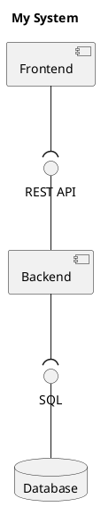
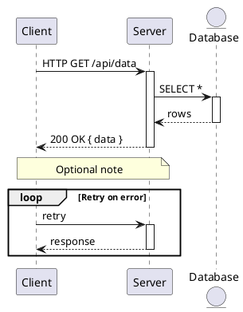
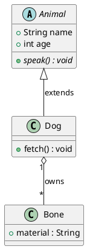
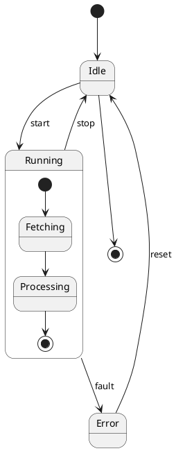
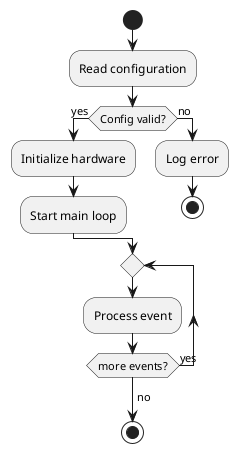
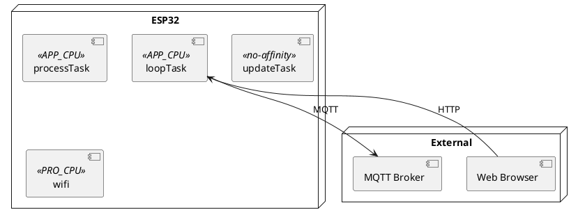
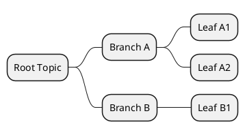
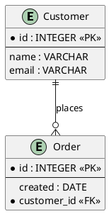

# PlantUML Diagram Types — Syntax Reference

All PlantUML source files start with `@startuml <name>` and end with `@enduml`.  
Use `'` for single-line comments and `/' ... '/` for block comments.

---

## Component Diagram

Shows hardware/software component structure and interfaces.



**Grouping:**
```plantuml
package "Subsystem" {
    component "Part A" as a
    component "Part B" as b
    a --> b
}
```

**Interface styles:** `--( ` (lollipop), `--` (plain line), `-->` (arrow)

---

## Sequence Diagram

Shows interactions over time between participants.



**Arrow types:**

| Syntax | Description          |
| ------ | -------------------- |
| `->`   | Solid arrow          |
| `-->`  | Dashed arrow         |
| `->>`  | Thin solid           |
| `-->>` | Thin dashed          |
| `-x`   | Lost message (cross) |
| `->o`  | Open arrow           |

**Blocks:** `loop`, `alt`/`else`, `opt`, `par`, `critical`, `break`, `group`

**Lifeline control:** `activate Foo` / `deactivate Foo` or `autoactivate on`

---

## Class Diagram

Shows class attributes, methods, and relationships.



**Relationship arrows:**

| Syntax  | Meaning                      |
| ------- | ---------------------------- |
| `<\|--` | Inheritance (extension)      |
| `*--`   | Composition                  |
| `o--`   | Aggregation                  |
| `-->`   | Association                  |
| `..>`   | Dependency                   |
| `..\|>` | Realization / implementation |

**Visibility:** `+` public, `-` private, `#` protected, `~` package

**Modifiers:** `{abstract}`, `{static}`, `{field}`, `{method}`

---

## State Diagram

Shows states and transitions for a state machine.



**Special states:** `[*]` (initial/final), `<<choice>>`, `<<fork>>`, `<<join>>`, `<<end>>`

**Notes:** `note right of StateName : text`

---

## Activity Diagram

Shows a process, algorithm, or decision flow.



**Swim lanes (partitions):**
```plantuml
|Actor A|
start
:Step 1;
|Actor B|
:Step 2;
stop
```

---

## Deployment Diagram

Shows deployment on hardware nodes and tasks/processes.



---

## Mindmap

Shows hierarchical topic/concept structure.



> Note: mindmaps use `@startmindmap` / `@endmindmap` instead of `@startuml` / `@enduml`.

---

## Entity-Relationship (ER) Diagram

Shows database table and entity relationships.



**Cardinality:** `||` exactly one, `|o` zero or one, `o{` zero or many, `|{` one or many

---

## Skinparam Cheat Sheet

Apply at the top of the file to control visual style:

```plantuml
skinparam componentStyle rectangle
skinparam monochrome true
skinparam shadowing false
skinparam defaultFontName Arial
skinparam ArrowColor #444444
skinparam PackageBorderColor #888888
```

---

## Common Tips

- Alias long names: `component "Long Component Name" as shortAlias`
- Force layout direction: `left to right direction` (top-level) or `rankdir=LR`
- Add notes: `note left of Foo : text` or `note as N1 ... end note`
- Use `together { A \n B }` to force elements to be on the same rank
- Avoid special characters in IDs; use `as` for display labels with spaces or punctuation
- Split large diagrams: keep each `.wsd` file focused on one subsystem or interaction
