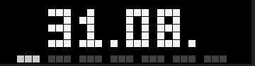
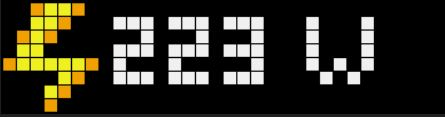
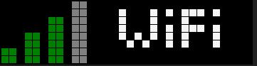

# PIXELIX


Full RGB LED matrix, based on an ESP32 and WS2812B LEDs.

[](http://choosealicense.com/licenses/mit/)
[](https://www.repostatus.org/#wip)
[](https://github.com/BlueAndi/esp-rgb-led-matrix/releases)
[](https://github.com/BlueAndi/esp-rgb-led-matrix/actions?query=workflow%3A%22PlatformIO+CI%22)

[](https://www.youtube.com/watch?v=dik8Rm6f3o0 "Pixelix")
[](https://www.youtube.com/watch?v=UCjJCI5JShY "Pixelix - Remote Button")

- [PIXELIX](#pixelix)
- [Motivation](#motivation)
- [Overview](#overview)
- [Very First Startup](#very-first-startup)
- [User Interface](#user-interface)
- [Documentation](#documentation)
- [Used Libraries](#used-libraries)
- [FAQ](#faq)
  - [Where to change panel topology of the LED matrix?](#where-to-change-panel-topology-of-the-led-matrix)
  - [How to change text properties?](#how-to-change-text-properties)
- [Issues, Ideas And Bugs](#issues-ideas-and-bugs)
- [License](#license)
- [Contribution](#contribution)

# Motivation
I want to have a remote display to show multiple kind of information, running 24/7 reliable. Connected over wifi to the local network, it can be controlled via REST API or websocket.

| Some impressions |   |
| - | - |
|  |  |
|  |  |
|  | ... |

# Overview

* [ESP32 DevKitV1](https://github.com/playelek/pinout-doit-32devkitv1)
* WS2812B 5050 8x32 RGB Flexible LED Matrix Panel
* Power supply 5 V / 4 A
* [Rough overview](./doc/Overview.pdf)

Additional supported variants, which were original not in focus:
* [TTGO T-Display ESP32 WiFi and Bluetooth Module Development Board For Arduino 1.14 Inch LCD](http://www.lilygo.cn/prod_view.aspx?TypeId=50033&Id=1126&FId=t3:50033:3)

Although Pixelix was designed to show information, that is pushed or pulled via REST API, the following sensors can be directly connected and evaluated:
* Temperature and humidity sensors DHTx
* Temperature and humidity sensors SHT3x

# Very First Startup
If the device starts the very first time, the wifi station SSID and passphrase are empty. To be able to configure them, start the device and keep the button pressed. The device will start up as wifi access point with the default SSID "pixelix" and the default password "Luke, I am your father.". The display itself will show the SSID of the webserver.

Connect to the captive portal and configure via webinterface the wifi station SSID and passphrase. Restart and voila!

# User Interface
* The user button activates always the next slot.
* If the display is at a place, which is hard to reach, the virtual user button can be used. It is controllable via REST API and perfect for remote buttons like the [Shelly Button 1](https://shelly.cloud/products/shelly-button-1-smart-home-automation-device/).
* If a LDR is connected, the display brightness is automatically adapted.
* The web interface provides the possibilty to install plugins, control their duration in the slots and etc.
* Some plugin's spawn a dedicated REST API, see the web page of the plugin or have a look to the REST API documentation.

Note, the websocket interface is currently only used as a service in the web interface.

# Documentation

For more information, see the [documentation](./doc/README.md).

# Used Libraries
* [Arduino](https://github.com/platformio/platform-espressif32) - ESP32 Arduino framework - Apache-2.0 License
* [NeoPixelBus](https://github.com/Makuna/NeoPixelBus) - Controlling the LED matrix with hardware support (RMT) - LGPL-3.0 License
* [ESPAsyncWebServer](https://github.com/me-no-dev/ESPAsyncWebServer) - Webserver - LGPL-2.1 License
* [AsyncTCP](https://github.com/me-no-dev/AsyncTCP) - TCP library - LGPL-3.0 License
* [ArduinoJson](https://arduinojson.org/) - JSON handling - MIT License
* [StreamUtils](https://github.com/bblanchon/ArduinoStreamUtils) - Stream utilities - MIT License
* [Bootstrap](https://getbootstrap.com/) - CSS Framework - MIT License
* [POPPER JS](https://popper.js.org/) - POPPER JS - MIT License
* [jQuery](https://jquery.com/) - Javascript librariy for DOM handling - MIT License
* [Adafruit Unified Sensor Driver](https://github.com/adafruit/Adafruit_Sensor) - A unified sensor abstraction layer. - Apache License 2.0 License
* [DHT sensor library](https://github.com/adafruit/DHT-sensor-library) - An Arduino library for the DHT series of low-cost temperature/humidity sensors. - MIT License
* [arduino-sht](https://github.com/Sensirion/arduino-sht) - An Arduino library for reading the SHT3x family of temperature and humidity sensors. - BSD-3-Clause License
* [TFT_eSPI](https://github.com/Bodmer/TFT_eSPI) - Arduino and PlatformIO IDE compatible TFT library optimised for the Raspberry Pi Pico (RP2040), STM32, ESP8266 and ESP32 that supports different driver chips - Mixed licenses: MIT, BSD, FreeBSD

# FAQ

## Where to change panel topology of the LED matrix?
First adapt in ```./lib/HalLedMatrix/Board.h``` the _width_ and _height_ according your LED matrix.

In the ```./lib/HalLedMatrix/LedMatrix.h``` file you have to change the member variable _m\_topo_ according to your physical panel topology. Take a look how your pixels are wired on the pcb and use the following page to choose the right one: https://github.com/Makuna/NeoPixelBus/wiki/Layout-objects

## How to change text properties?

Text properties can be changed using different keywords added to the string to be displayed.  
In order to be able to use these keywords, they must be prefixed by a backslash, otherwise they will only be treated as text.

The following keywords are available:
Keyword   | Description
----------|---------------------------------
\\#RRGGBB | Change text color (RRGGBB in hex)
\lalign   | Alignment left
\ralign   | Alignment right
\calign   | Alignment center


**Note**
- If theses keywords are used within the sourcecode they have to be prefixed with two backslashes (one additional for escaping).
- If these keywords are used via the [REST API](REST.md) all unsafe ASCII characters must be replaced by the respective percent encoding (see also [ASCII Encoding Reference](https://www.w3schools.com/tags/ref_urlencode.ASP)).
- The keywords can be combined.  

**Examples**

Sourcecode   | URL   | Result
----------|--------------------|-------------
\\\lalign\\\\#ff0000Hi! | %5Clalign%23ff0000Hi! | I<span style="color:red">Hi!</span>&nbsp;&nbsp;&nbsp;&nbsp;&nbsp;&nbsp;&nbsp;&nbsp;I
\\\calign\\#ff0000Hi! | %5Ccalign%23ff0000Hi! | I&nbsp;&nbsp;&nbsp;&nbsp;<span style="color:red">Hi!</span>&nbsp;&nbsp;&nbsp;&nbsp;I
\\\ralign\\#ff0000Hi! | %5Ccalign%23ff0000Hi!| I&nbsp;&nbsp;&nbsp;&nbsp;&nbsp;&nbsp;&nbsp;&nbsp;<span style="color:red">Hi!</span>I


# Issues, Ideas And Bugs
If you have further ideas or you found some bugs, great! Create a [issue](https://github.com/BlueAndi/esp-rgb-led-matrix/issues) or if you are able and willing to fix it by yourself, clone the repository and create a pull request.

# License
The whole source code is published under the [MIT license](http://choosealicense.com/licenses/mit/).
Consider the different licenses of the used third party libraries too!

# Contribution
Unless you explicitly state otherwise, any contribution intentionally submitted for inclusion in the work by you, shall be licensed as above, without any
additional terms or conditions.
