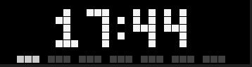
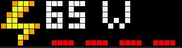
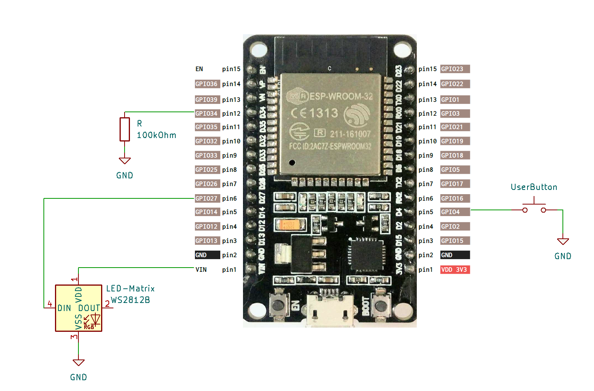

# PIXELIX <!-- omit in toc -->


Full RGB LED matrix, based on an ESP32 and WS2812B LEDs.

[](http://choosealicense.com/licenses/mit/)
[](https://www.repostatus.org/#wip)
[](https://github.com/BlueAndi/esp-rgb-led-matrix/releases)
[](https://github.com/BlueAndi/esp-rgb-led-matrix/actions/workflows/main.yml)

[](https://www.youtube.com/watch?v=dik8Rm6f3o0 "Pixelix")
[](https://www.youtube.com/watch?v=UCjJCI5JShY "Pixelix - Remote Button")

* [Motivation](#motivation)
* [Introduction](#introduction)
* [Features](#features)
* [Original Setup](#original-setup)
* [Attention](#attention)
* [Supported Development Boards](#supported-development-boards)
  * [Recommendation](#recommendation)
  * [Special Variants](#special-variants)
* [Installation](#installation)
* [Very First Startup](#very-first-startup)
  * [Variant 1: Configure wifi station SSID and passphrase with the browser](#variant-1-configure-wifi-station-ssid-and-passphrase-with-the-browser)
  * [Variant 2: Configure wifi station SSID and passphrase with the terminal](#variant-2-configure-wifi-station-ssid-and-passphrase-with-the-terminal)
  * [PIXELIX Is Ready](#pixelix-is-ready)
* [User Interface](#user-interface)
* [Details](#details)
* [FAQ](#faq)
  * [Where to change panel topology of the LED matrix?](#where-to-change-panel-topology-of-the-led-matrix)
  * [How to change text properties?](#how-to-change-text-properties)
  * [The display only shows a error code, like "E4". What does that mean?](#the-display-only-shows-a-error-code-like-e4-what-does-that-mean)
  * [How can I use animated icons?](#how-can-i-use-animated-icons)
  * [How do I know that my sensor is recognized?](#how-do-i-know-that-my-sensor-is-recognized)
  * [Why do I see sometimes values from the LDR in the SensorPlugin, although no LDR is installed?](#why-do-i-see-sometimes-values-from-the-ldr-in-the-sensorplugin-although-no-ldr-is-installed)
  * [How can I use alternative icons?](#how-can-i-use-alternative-icons)
  * [Is it possible to use a font with 8px height?](#is-it-possible-to-use-a-font-with-8px-height)
  * [How to configure the date/time format?](#how-to-configure-the-datetime-format)
  * [How to configure my own list of plugins?](#how-to-configure-my-own-list-of-plugins)
  * [Is there an easy way to rotate the display by 180° ? I need to turn the display when putting it into a housing.](#is-there-an-easy-way-to-rotate-the-display-by-180--i-need-to-turn-the-display-when-putting-it-into-a-housing)
* [Used Libraries](#used-libraries)
* [Issues, Ideas And Bugs](#issues-ideas-and-bugs)
* [License](#license)
* [Contribution](#contribution)

# Motivation
My initial goal was to have a remote display that would show multiple kind of information and run reliably 24/7. Can be connected to the local network via WiFi and controlled via REST API or Websocket. PIXELIX was born! :-)

# Introduction
The PIXELIX firmware is for ESP32 boards that controls a RGB LED matrix. It can be used to display text and animations.

# Features
* Supports 32x8 LED matrix size out of the box. Its possible to cascade another matrix to have a longer display.
* Can display static or scrolling text, as well as static (BMP and GIF) or animated icons (GIF).
* Includes a web interface for configuring and controlling the LED matrix.
* Supports REST API and MQTT for remote control and integration with other systems, like [Home Assistant](https://www.home-assistant.io/).
* Can be extended with custom effects and animations. See list of [plugins](./doc/PLUGINS.md).

Please note, that not every feature might be available for all kind of development boards. E.g. for MQTT support you need a development board with 8 MB flash or more. See the `config<variant>.ini` configuration files in [./config](./config) folder.

| Some impressions |   |
| - | - |
|  |  |
|  |  |
|  | ... |

# Original Setup
The original setup for development and the first release was:
* [ESP32 DevKitV1](https://github.com/playelek/pinout-doit-32devkitv1)
* WS2812B 5050 8x32 RGB Flexible LED Matrix Panel
* Power supply 5 V / 4 A

The following shows the absolute minimal wiring setup e.g. for the ESP32 DevKitV1. It may differ depended on your development board.



# Attention

> :warning: **If you power the development board and the LED matrix via USB**: Be very careful, because it may destroy your ESP32 board if the LED current is too high. Avoid increasing the LED display brightness or filling it complete with white pixels. Please use a external power supply with at least 5V / 4A.

> :information_source: To avoid any damage on your hardware and by the way to your eyes ;-), PIXELIX starts up with a low brightness setting. Additional the max. current is limited by software.

# Supported Development Boards

In the meantime several other boards are supported as well. You can find them in the [list of boards](./doc/boards/README.md).

With the [Ulanzi TC001 smart pixel clock](https://www.ulanzi.com/products/ulanzi-pixel-smart-clock-2882) you even don't need to assemble the electronic and mechanic together.

## Recommendation
If you assemble your own Pixelix hardware, its recommended to use a development board with 8 MB flash or more. 4 MB flash modules are still supported, but the functionality is limited. Also recommended is to use a esp32 dual core variant, which provides more processing power.

## Special Variants

Additional supported variants, which were original not in focus:
* [LILYGO&reg; TTGO T-Display ESP32 WiFi and Bluetooth Module Development Board For Arduino 1.14 Inch LCD](http://www.lilygo.cn/prod_view.aspx?TypeId=50033&Id=1126&FId=t3:50033:3)
* [LILYGO&reg; T-Display ESP32-S3 1.9 inch ST7789 LCD Display Touch Screen Development Board](https://www.lilygo.cc/products/t-display-s3)
* Limited HUB75 panel support, configured as an example for the ESP32-DoIt DevKit v1 development board.

Although PIXELIX was designed to show information, that is pushed or pulled via REST API, the following sensors can be directly connected and evaluated:
* Temperature and humidity sensors DHTx
* Temperature and humidity sensors SHT3x
* Digitial microphone INMP441 for some sound reactive stuff.

# Installation
The following steps are necessary for the first time and to get PIXELIX initial running on the target. Once it runs, later on the firmware and filesystem can be updated via the PIXELIX web interface.

1. Setup the [toolchain](./doc/config/TOOLCHAIN-INSTALLATION.md).
2. [Build the software](./doc/config/SW-BUILD.md) and check whether the toolchain works.
3. [Upload/Update the software and firmware](./doc/config/SW-UPDATE.md) to the target.
4. Verify that the LED panel topology is correct and you see the "Hello World" on the display.

Note, that the LED panel topology and the display width/height can currently not be changed in the web interface. If its necessary, adapt first in ```./config/display.ini``` the _CONFIG_LED_MATRIX_WIDTH_ and _CONFIG_LED_MATRIX_HEIGHT_ according your LED matrix and change _CONFIG_LED_TOPO_ according to your physical panel topology. Take a look how your pixels are wired on the pcb and use the following page to choose the right one: https://github.com/Makuna/NeoPixelBus/wiki/Layout-objects

# Very First Startup
If the device starts the very first time, the wifi station SSID and passphrase settings are empty. They can be configured in two possible ways:
1. Using the browser and set them in the captive portal.
2. Using a terminal connecting via usb.

## Variant 1: Configure wifi station SSID and passphrase with the browser
Restart the device and **keep the button pressed** until it shows the SSID of the wifi access point, spawned by PIXELIX. Search for it with your mobile device and connect.
* SSID: **pixelix-&lt;DEVICE-ID&gt;**
* Passphrase: **Luke, I am your father.**

Depended on the type of device you are using for connecting to PIXELIX, you may get a notification that further information is necessary and automatically routed to the captive portal. In any other case enter the URL http://192.168.4.1 in the browser address field.

Use the following default credentials to get access to the PIXELIX web interface:
* User: **luke**
* Password: **skywalker**

## Variant 2: Configure wifi station SSID and passphrase with the terminal
Connect PIXELIX with your PC via usb and start a terminal. Use the following commands to set the wifi SSID and passphrase of your home wifi network:
* Write wifi passphrase: ```write wifi passphrase <your-passphrase>```
* Write wifi SSID: ```write wifi ssid <your-ssid>```
* Restart PIXELIX: ```reset```
* Get IP-address: ```get ip```
* Get status: ```get status```
  * A status of 0 means everything is ok.
  * Other than 0, see their meaning in the low [low level error code table](#the-display-only-shows-a-error-code-like-e4-what-does-that-mean). Note, the status of 1 is equal to E1 in the error code table and etc.

Enter ```help``` to get a list of all supported commands.

## PIXELIX Is Ready
After configuration, restart again and voila, PIXELIX will be available in your wifi network.

For changing whats displayed, go to its web interface. Use the same credentials than for the captive portal in variant 1. In the "Display" page you can change it according to your needs.

# User Interface
* Pixelix can be controlled with buttons. Most of the development boards are supported with just one user button.
  * One button control:
    * 1 short pulse: Activates the next slot.
    * 2 short pulses: Activates the previous slot.
    * 3 short pulses: Activates next fade effect.
    * 4 short pulses: IP address is shown.
    * 5 short pulses: Toggle display power on/off.
    * Long pressed: Increases the display brightness until maximum and then decreases until minimum. After that it will again increases it and so on.
  * Two button control (LILYGO&reg; T-Display ESP32-S3):
    * Left button:
      * 1 short pulses: Activates the previous slot.
      * 2 short pulses: Toggle display power on/off.
      * Long pressed: Decreases the display brightness until minimum. 
    * Right button
      * 1 short pulse: Activates the next slot.
      * 2 short pulses: Activates next fade effect.
      * 3 short pulses: IP address is shown.
      * Long pressed: Increases the display brightness until maximum. 
  * Three button control (Ulanzi TC001):
    * Left button:
      * 1 short pulses: Activates the previous slot.
      * Long pressed: Decreases the display brightness until minimum.
    * Ok button:
      * 1 short pulses: Activates next fade effect.
      * 2 short pulses: IP address is shown.
      * Long pressed: Toggle display power on/off.
    * Right button
      * 1 short pulse: Activates the next slot.
      * Long pressed: Increases the display brightness until maximum. 
* If the display's location is hard to reach, the virtual user button can be used. It is controllable via REST API and perfect for remote buttons like the [Shelly Button 1](https://shelly.cloud/products/shelly-button-1-smart-home-automation-device/).
* If a ambilight sensor (LDR) is connected, the display brightness is automatically adapted.
* The web interface provides the possibility to install plugins, control their duration in the slots and etc.
* Some plugin's spawn a dedicated REST API, see the web page of the plugin or have a look to the REST API documentation.

Note, the websocket interface is currently only used as a service in the web interface.

# Details
For more detailed information, see the [documentation](./doc/README.md).

# FAQ

## Where to change panel topology of the LED matrix?
Adapt in ```./config/display.ini``` the _CONFIG_LED_MATRIX_WIDTH_ and _CONFIG_LED_MATRIX_HEIGHT_ according your LED matrix and change _CONFIG_LED_TOPO_ according to your physical panel topology. Take a look how your pixels are wired on the pcb and use the following page to choose the right one: https://github.com/Makuna/NeoPixelBus/wiki/Layout-objects

## How to change text properties?
Text properties can be changed using different keywords added to the string to be displayed.  
In order to be able to use these keywords, they must be inside curly braces, otherwise they will only be treated as text.

The following keywords are available:
Keyword   | Description
----------|---------------------------------
{#RRGGBB} | Change text color (RRGGBB in hex)
{hl}      | Horizontal alignment left
{hc}      | Horizontal alignment right
{hr}      | Horizontal alignment center
{vt}      | Vertical alignment top
{vc}      | Vertical alignment center
{vb}      | Vertical alignment bottom

**Notes**
- If these keywords are used via the [REST API](https://app.swaggerhub.com/apis/BlueAndi/Pixelix/1.2.0) all unsafe ASCII characters must be replaced by the respective percent encoding (see also [ASCII Encoding Reference](https://www.w3schools.com/tags/ref_urlencode.ASP)).
- The keywords can be combined.  

**Examples**

Sourcecode       | URL               | Result
-----------------|-------------------|-------------
{hl}{#ff0000}Hi! | %7Bcl%7Dff0000Hi! | I<span style="color:red">Hi!</span>&nbsp;&nbsp;&nbsp;&nbsp;&nbsp;&nbsp;&nbsp;&nbsp;I
{hc}{#ff0000}Hi! | %7Bhc%7Dff0000Hi! | I&nbsp;&nbsp;&nbsp;&nbsp;<span style="color:red">Hi!</span>&nbsp;&nbsp;&nbsp;&nbsp;I
{hr}{#ff0000}Hi! | %7Bhr%7Dff0000Hi! | I&nbsp;&nbsp;&nbsp;&nbsp;&nbsp;&nbsp;&nbsp;&nbsp;<span style="color:red">Hi!</span>I

## The display only shows a error code, like "E4". What does that mean?

This is a low level error code. Please have a look into the following table.

| Error code | Description |
| ---------- | ----------- |
| E1 | Something happened, which can not be further explained, but was fatal. |
| E2 | There is a problem with the two-wire (i2c) interface. |
| E3 | There is no user button available. |
| E4 | Bad filesystem, did you explicit program the filesystem too? If not, please upload it. |
| E5 | The display manager didn't start up. |
| E6 | The system message handler didn't start up. |
| E7 | The update manager didn't start up. |
| E8 | One of the services failed to start. |

## How can I use animated icons?
Use animated GIF images to get animated icons. The sprite sheet support (< v8.0.0) was replaced with the GIF images.

If you like to create animated GIFs by yourself, the [Piskel](https://www.piskelapp.com/) editor is recommended. Piskel is a free online editor for animated sprites & pixel art.

## How do I know that my sensor is recognized?

1. Check the log output from USB (not via web interface) right after startup (at this point WiFi is not connected yet).
2. Install the SensorPlugin and open the SensorPlugin website. There the sensor should be shown in the drop-down.

## Why do I see sometimes values from the LDR in the SensorPlugin, although no LDR is installed?

The LDR pin is configured as input (ADC) and it seems that the pin is floating, because there is the ext. pull-down missing.

## How can I use alternative icons?

Find details [here](./doc/ICONS.md).

## Is it possible to use a font with 8px height?
There are three font types defined:
* default (6px height)
* normal (6px height)
* large (8px height)

Note, the default font type is "normal".

The font type can be selected per plugin instance in the settings web page.

Example:
```json
{
    "name": "JustTextPlugin",
    "uid": 32690,
    "alias": "",
    "fontType": "large"
}
```

Not all plugin may support this in case they get conflicts with their layout.
If a plugin don't support it, it will use the default font type.

## How to configure the date/time format?
The date/time format used by plugins, e.g. the DateTimePlugin or the SunrisePlugin, can be configured in their configuration JSON file. Use the file editor in the web interface to modify it according to your needs. The file can be found in the ```/configuration``` folder and the filename is ```<PLUGIN-UID>.json```. The format specifiers following [strftime()](https://cplusplus.com/reference/ctime/strftime/).

Examples:
* ```%I:%M %p```: 02:30 PM
* ```%H:%M```: 14:30
* ```%m/%d```: 11/12
* ```%d.%m.```: 11.12.
* ```%d - %b```: 11 - Nov

You can colorize it by using the [text properties](#how-to-change-text-properties).

## How to configure my own list of plugins?
The list of plugins which are available depend on the development board you use. Because board with only 4 MB flash don't have enough capacity for all. Or in case of a ESP-S2 (single core) not enough power.

To handle there are several .ini files in the ```./config``` folder:
* configSmall.ini: Used for boards with 4 MB flash.
* configNormal.ini: Used for boards with 8 MB flash or more.
* configSmallNoI2s.ini: Used for boards with 4 MB flash and less mcu power.

Update the one you use for your needs by commenting in or out.

## Is there an easy way to rotate the display by 180° ? I need to turn the display when putting it into a housing.
Change option CONFIG_DISPLAY_ROTATE180 in ```config/display.ini``` to 1 as shown below and rebuild.

Example:
```ini
[display:common]
build_flags =
    -D CONFIG_DISPLAY_ROTATE180=1
```

# Used Libraries

| Library | Description | License |
| - | - | - |
| [Arduino](https://github.com/platformio/platform-espressif32) | ESP32 Arduino framework v2.x.x | Apache-2.0 |
| [PlatformIO](https://platformio.org) | PlatformIO is a cross-platform, cross-architecture, multiple framework, professional tool for embedded systems engineers and for software developers who write applications for embedded products. | Apache-2.0 |
| [NeoPixelBus](https://github.com/Makuna/NeoPixelBus) | Controlling the LED matrix with hardware support (I2S) | LGPL-3.0 |
| [ESPAsyncWebServer](https://github.com/me-no-dev/ESPAsyncWebServer) | Webserver | LGPL-2.1 |
| [AsyncTCPSock](https://github.com/yubox-node-org/AsyncTCPSock) | TCP library, Reimplementation of the API of me-no-dev/AsyncTCP using high-level BSD sockets | MIT |
| [ArduinoJson](https://arduinojson.org/) | JSON handling | MIT |
| [StreamUtils](https://github.com/bblanchon/ArduinoStreamUtils) | Stream utilities | MIT |
| [Bootstrap](https://getbootstrap.com/) | CSS Framework | MIT |
| [POPPER JS](https://popper.js.org/) | POPPER JS | MIT |
| [jQuery](https://jquery.com/) | Javascript librariy for DOM handling | MIT |
| [Adafruit Unified Sensor Driver](https://github.com/adafruit/Adafruit_Sensor) | A unified sensor abstraction layer. | Apache License 2.0 |
| [Adafruit DHT sensor library](https://github.com/adafruit/DHT-sensor-library) | An Arduino library for the DHT series of low-cost temperature/humidity sensors. | MIT |
| [arduino-sht](https://github.com/Sensirion/arduino-sht) | An Arduino library for reading the SHT3x family of temperature and humidity sensors. | BSD-3-Clause |
| [TFT_eSPI](https://github.com/Bodmer/TFT_eSPI) | Arduino and PlatformIO IDE compatible TFT library optimised for the Raspberry Pi Pico (RP2040), STM32, ESP8266 and ESP32 that supports different driver chips | Mixed licenses: MIT, BSD, FreeBSD |
| [arduinoFFT](https://github.com/kosme/arduinoFFT) | Fast Fourier Transform for Arduino. | GPL 3.0 |
| [mufonts](https://github.com/muwerk/mufonts) | A collection of fonts compatible with Adafruit GFX library. These fonts were developed when creating various samples for mupplet display code. | MIT |
| [JSZip](https://github.com/Stuk/jszip) | A library for creating, reading and editing .zip files with JavaScript, with a lovely and simple API. | MIT |
| [JSZipUtils](https://github.com/Stuk/jszip-utils) | A collection of cross-browser utilities to go along with JSZip. | MIT |
| [FileSaver.js](https://github.com/eligrey/FileSaver.js) | FileSaver.js is the solution to saving files on the client-side. | MIT |
| [Arduino client for MQTT](https://github.com/knolleary/pubsubclient) | This library provides a client for doing simple publish/subscribe messaging with a server that supports MQTT. | MIT |

# Issues, Ideas And Bugs
If you have further ideas or you found some bugs, great! Create a [issue](https://github.com/BlueAndi/esp-rgb-led-matrix/issues) or if you are able and willing to fix it by yourself, clone the repository and create a pull request. For questions to the community or showing the own Pixelix, the [Discord server](https://discord.gg/D3uYhBQBhf) can be used.

# License
The whole source code is published under the [MIT license](http://choosealicense.com/licenses/mit/).
Consider the different licenses of the used third party libraries too!

# Contribution
Unless you explicitly state otherwise, any contribution intentionally submitted for inclusion in the work by you, shall be licensed as above, without any
additional terms or conditions.
