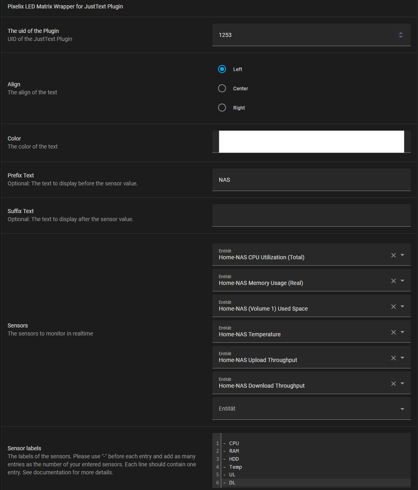

# PIXELIX <!-- omit in toc -->


# Home Assistant <!-- omit in toc -->

* [Purpose](#purpose)
* [REST API](#rest-api)
  * [Installation](#installation)
  * [Setting up REST command](#setting-up-rest-command)
  * [Import Blueprint](#import-blueprint)
  * [Generate an automation](#generate-an-automation)
* [MQTT](#mqtt)
  * [Installation](#installation-1)
  * [MQTT Discovery](#mqtt-discovery)
* [Issues, Ideas And Bugs](#issues-ideas-and-bugs)
* [License](#license)
* [Contribution](#contribution)

# Purpose
To display e.g. sensor data from your [Home Assistant](https://www.home-assistant.io/) instance, there are two possibilitis. Using the REST API or MQTT.

# REST API
The following wrapper supports for now only the JustTextPlugin.

## Installation
If you want to add the wrapper to your Home Assistant instance you first need to add a REST command to your `configuration.yaml`.

## Setting up REST command
Add the following lines of code to your `configuration.yaml`:
```yaml
rest_command:
  pixelix_just_text:
    url: 'http://192.168.178.10/rest/api/v1/display/uid/{{ uid }}/text?text={{ "%5C" + align + "%5C" + color + text }}'
    method: POST
```
You need to replace the IP `192.168.178.10` with your Pixelix instance IP.

## Import Blueprint
You can use this link to add the wrapper to your Home Assistant installation.

[](https://my.home-assistant.io/redirect/blueprint_import/?blueprint_url=https%3A%2F%2Fgithub.com%2FBlueAndi%2Fesp-rgb-led-matrix%2Fblob%2Fmain%2Fdoc%2Fhomeassistant%2Fpixelix-justtext.yaml)

As an alternative you can copy the yaml to  `/config/blueprints/automation/homeassistant/`.
You can find the raw YAML file [here](./homeassistant/pixelix-justtext.yaml "here")

## Generate an automation
First of all you need to install a "JustText"-Plugin in a slot in your Pixelix installation. Then note down the uid of the plugin.



The fields should be pretty self-explanatory.
Just note that you have to enter the sensor labels in the following format:
```
- Sensor Label 1
- Sensor Label 2
- Sensor Label 3
```
See it in the example screenshot above.
**Important:** Each sensor entry **must have** an corresponding sensor label entry!

# MQTT
MQTT is not part of every Pixelix installation. It depends on the development board specific configuration or in other words, mainly on the available flash size. For development boards with less than 8 MB flash, its disabled by default. You can enable it, but need to compile it by yourself and throw other plugins out to get it fit.

## Installation
If not already installed, you will need to add the MQTT integration

[](https://my.home-assistant.io/redirect/config_flow_start?domain=mqtt)

## MQTT Discovery
The Home Assistant automatic MQTT discovery is supported by the following plugins:
* JustTextPlugin
* IconTextPlugin
* IconTextLampPlugin

Pixelix will be shown as device with its entities. Every installed plugin will be shown as at least one entity. By default the plugin UID is used to generate the entity id in Home Assistant. If the plugin instance has an alias, another entity with the alias as entity id will be available.

[More technical details about MQTT](./MQTT.md)

# Issues, Ideas And Bugs
If you have further ideas or you found some bugs, great! Create a [issue](https://github.com/BlueAndi/esp-rgb-led-matrix/issues) or if you are able and willing to fix it by yourself, clone the repository and create a pull request.

# License
The whole source code is published under the [MIT license](http://choosealicense.com/licenses/mit/).
Consider the different licenses of the used third party libraries too!

# Contribution
Unless you explicitly state otherwise, any contribution intentionally submitted for inclusion in the work by you, shall be licensed as above, without any
additional terms or conditions.
