# PIXELIX <!-- omit in toc -->


[](http://choosealicense.com/licenses/mit/)

# Alternative Icons

* [Alternative Icons](#alternative-icons)
* [Purpose](#purpose)
* [OpenWeatherPlugin](#openweatherplugin)
  * [Color Intense](#color-intense)
  * [Animated](#animated)
* [BTCQuotePlugin](#btcquoteplugin)
* [Issues, Ideas And Bugs](#issues-ideas-and-bugs)
* [License](#license)
* [Contribution](#contribution)

# Purpose

In order to use alternative icons for plugins you simply have to replace the respective ```<iconName>.bmp``` or in case of an animation additional the ```<iconName>.sprite``` in the corresponding plugin folder. All plugins can be found in ```/lib/<PLUGIN-NAME>``` and their icons in ```/lib/<PLUGIN-NAME>/web```.

During building the filesystem image they will be automatically grabbed.

**Note** the name of the respective icon must not be changed!

In the following you find all available alternative icons classified according to plugin.

# OpenWeatherPlugin

## Color Intense

|  |  |  |  |
| -------- | -------- | -------- | -------- |
|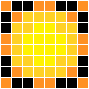|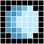|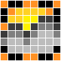|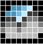|
|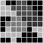|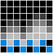|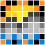|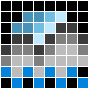|
|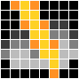|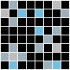|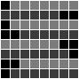||

Find them here: [./images/icons/OpenWeatherPluginColorIntense/](./images/icons/OpenWeatherPluginColorIntense/)

Designed by [NSD4rKn3SS](https://github.com/NSD4rKn3SS)

## Animated

|  |  |  |  |
| -------- | -------- | -------- | -------- |
|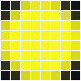||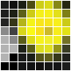||
|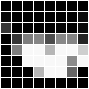|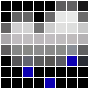|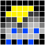||
|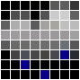|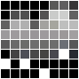|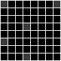||

Find them here: [./images/icons/OpenWeatherPluginAnimated/](./images/icons/OpenWeatherPluginAnimated/)

Designed by [ddijanic](https://github.com/ddijanic)

# BTCQuotePlugin

|  |
| -------- |
|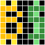|

Find them here: [./images/icons/BTCQuotePluginColorIntense/](./images/icons/BTCQuotePluginColorIntense/)

Designed by [NSD4rKn3SS](https://github.com/NSD4rKn3SS)

# Issues, Ideas And Bugs
If you have further ideas or you found some bugs, great! Create a [issue](https://github.com/BlueAndi/esp-rgb-led-matrix/issues) or if you are able and willing to fix it by yourself, clone the repository and create a pull request.

# License
The whole source code is published under the [MIT license](http://choosealicense.com/licenses/mit/).
Consider the different licenses of the used third party libraries too!

# Contribution
Unless you explicitly state otherwise, any contribution intentionally submitted for inclusion in the work by you, shall be licensed as above, without any
additional terms or conditions.
