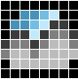
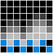

# Alternative icons

In order to use an alternative icon you simply have to replace the respective ```<iconName>```.bmp in your local /data/images folder with the one from /doc/images/icons/alternativeIcons before building the filesystem image.

**Note** the name of the respective icon must not be changed!

In the following you find all available alternative icons classified according to plugin.

## OpenWeatherPlugin

|  |  |  |  |
| -------- | -------- | -------- | -------- |
|||||
|||||
|||||


Designed by [NSD4rKn3SS](https://github.com/NSD4rKn3SS)

## BTCQuotePlugin

|  |  |  |  |
| -------- | -------- | -------- | -------- |
|||||

Designed by [NSD4rKn3SS](https://github.com/NSD4rKn3SS)
