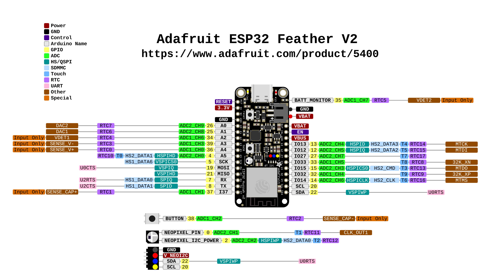

# PIXELIX <!-- omit in toc -->

# Electronic <!-- omit in toc -->

- [Version](#version)
- [System Diagram](#system-diagram)
- [Differences to v1.5](#differences-to-v15)
- [Development Boards](#development-boards)
  - [ESP32 DevKit C V4](#esp32-devkit-c-v4)
  - [Adafruit ESP32 Feather V2](#adafruit-esp32-feather-v2)
- [Strapping Pins](#strapping-pins)
- [Input Only Pins](#input-only-pins)
- [Analog Pins](#analog-pins)
- [JTAG](#jtag)
- [LED Matrix](#led-matrix)
- [Ambient Light Sensor](#ambient-light-sensor)
- [Issues, Ideas And Bugs](#issues-ideas-and-bugs)
- [License](#license)
- [Contribution](#contribution)

# Version

PCB board v2.0

# System Diagram

# Differences to v1.5

* The clock crystal in v1.5 was removed, because it wasn't used.
* The I2S interface was added for digital microphones, like the INMP441.
* ESP32 Dev Kit C V4 will be used instead of ESP32 DEVKIT V1.
* It is also possible to use the Adafruit ESP32 Feather V2 instead of the ESP32 Dev Kit C V4.

# Development Boards 
## ESP32 DevKit C V4

| ESP32 DevKit V4 Pin | ESP32 DevKit V4 Pin Header | WROOM32 Pin | Notes | Usage |
| --- | --- | --- | --- | --- |
| 3V3 | J1-1 | 3V3 | 3.3 V output | +3V3|
| EN | J1-2 | EN | 10k Pull-Up; Button on ESP32 DevKit V4; Active High | RESET |
| VP | J1-3 | GPIO 36 (VP) | Input only! See ESP32 tech. reference manual, chapter 4.1 (no internal pull-up/down circuitry) | - |
| VN | J1-4 | GPIO 39 (VN) | Input only! See ESP32 tech. reference manual, chapter 4.1 (no internal pull-up/down circuitry) | - |
| 34 | J1-5 | GPIO 34 | Input only! See ESP32 tech. reference manual, chapter 4.1 (no internal pull-up/down circuitry) | LDR Analog In |
| 35 | J1-6 | GPIO 35 | Input only! See ESP32 tech. reference manual, chapter 4.1 (no internal pull-up/down circuitry) | - |
| 32 | J1-7 | GPIO 32 | Input only! See ESP32 tech. reference manual, chapter 4.1 (no internal pull-up/down circuitry) | - |
| 33 | J1-8 | GPIO 33 | I2S microphone serial data. | I2S_Data_IN |
| 25 | J1-9 | GPIO 25 | I2S microphone word select. | I2S_WS |
| 26 | J1-10 | GPIO 26 | I2S microphone serial clock. | I2S_CLK |
| 27 | J1-11 | GPIO 27 | Data Out to LED matrix | LV-DATA-OUT |
| 14 | J1-12 | GPIO 14 | Output PWM at power-up! | MTMS |
| 12 | J1-13 | GPIO 12 | Strapping pin; Fails if high at power-up, therefore not used. | MTDI |
| GND | J1-14 | GND | Ground | GND |
| 13 | J1-15 | GPIO 13 | - | MTCK |
| 2 | J1-16 | GPIO 9 (D2) | Pin shared with Flash Memory (Can´t be used as regular Pin) | - |
| 3 | J1-17 | GPIO 10 (D3) | Pin shared with Flash Memory (Can´t be used as regular Pin) | - |
| CMD | J1-18 | GPIO 11 (CMD) | - | - |
| 5V | J1-19 | 5V0 | external power supply | VCC-PROTECTED |
| GND | J2-1 | GND | Ground | GND |
| 23 | J2-2 | GPIO 23 | - | Test Pin |
| 22 | J2-3 | GPIO 22 | I2C SCL (Arduino Standard) | I2C SCL |
| TX0 | J2-4 | GPIO 1 (TX0) | USB TX | - |
| RX0 | J2-5 | GPIO 3 (RX0) | USB RX | - |
| 21 | J2-6 | GPIO 21 | I2C SDA (Arduino Standard) | I2C SDA |
| GND | J2-7 | GND | Ground | GND |
| 19 | J2-8 | GPIO 19 | - | - |
| 18 | J2-9 | GPIO 18 | - | - |
| 5 | J2-10 | GPIO 5 | Strapping pin; 10k Pull-Up on ESP32 DevKit V4 | (DHT In) |
| 17 | J2-11 | GPIO 17 (TX2) | - | - |
| 16 | J2-12 | GPIO 16 (RX2) | - | - |
| 4 | J2-13 | GPIO 4 | User Button | USER-BUTTON |
| 0 | J2-14 | GPIO 0 | Strapping pin, 10k Pull-Up; Button on ESP32 DevKit V4, closing to GND | - |
| 2 | J2-15 | GPIO 2 | Strapping pin; Onboard LED on ESP32 DevKit V4 | Onboard LED |
| 15 | J2-16 | GPIO 15 | Strapping pin | MTDO |
| D1 | J2-17 | GPIO 8 (D1) | - | - |
| D0 | J2-18 | GPIO 7 (D0) | - | - |
| CLK | J2-19 | GPIO 6 (SCK) | - | - |

## Adafruit ESP32 Feather V2

| Adafruit ESP32 Feather V2 Pin | Adafruit Feather V2 Pin Header | WROOM32 Pin | Notes | Usage |
| --- | --- | --- | --- | --- |
| RST | J1-1 | RESET | The reset pin is used for the reset button, but can also be used standalone. Tie it to ground to reset the board. Pull-Up; Button on Feather V2; Active High | RESET |
| 3V | J1-2 | 3.3V | 3.3 V output | +3V3 |
| NC | J1-3 | - | Not Connected | - | 
| GND | J1-4 | GND | Ground | GND |
| A0 | J1-5 | GPIO 26 (A0) | This is also DAC2. It uses ADC2 | I2S_CLK |
| A1 | J1-6 | GPIO 25 (A1) | This is also DAC1. It uses ADC2 | I2S_WS |
| A2 | J1-7 | GPIO 34 (A2) | It is input/ADC only. It uses ADC1 | LDR-ANALOG-IN |
| A3 | J1-8 | GPIO 39 (A3) | It is input/ADC only. It uses ADC1 | - |
| A4 | J1-9 | GPIO 36 (A4) | It is input/ADC only. It uses ADC1 | - |
| A5 | J1-10 | GPIO 4 (A5) | It uses ADC2 | USER-BUTTON |
| SCK | J1-11 | GPIO 5 | This is the SPI clock pin | (DHT In) |
| MO | J1-12 | GPIO 19 | This is the SPI Microcontroller Out / Serial In (MOSI) pin (Adafruit Feather V2 Schematic-Symbol is wrong! -> IO18) | - |
| MI | J1-13 | GPIO 21 | This is the SPI Microcontroller In / Serial Out (MISO) pin (Adafruit Feather V2 Schematic-Symbol is wrong! -> IO19) | - |
| RX | J1-14 | GPIO 7 | This is the UART RX (receive) pin | - |
| TX | J1-15 | GPIO 8 | This is the UART TX (transmit) pin | - |
| 37 | J1-16 | GPIO 37 | It is input/ADC only. It uses ADC1 | - |
| GND | J2-1 | GND | Ground; **JST connector** | GND |
| BAT | J2-2 | VBAT | This is the positive voltage to the **JST connector** for the optional lipoly battery | - |
| BAT | J3-1 | VBAT | This is the positive voltage from the JST connector for the optional lipoly battery | - |
| EN | J3-2 | EN | This is the 3.3V regulator's enable pin. It's pulled up, so connect to ground to disable the 3.3V regulator | - |
| USB | J3-3 | VBUS | This is the positive voltage to/from the USB-C connector if connected | VCC-PROTECTED |
| 13 | J3-4 | GPIO 13 | It uses ADC2; Onboard LED | MTCK and Onboard LED |
| 12 | J3-5 | GPIO 12 | It uses ADC2 | MTDI |
| 27 | J3-6 | GPIO 27 | It uses ADC2 | LV-DATA-OUT |
| 33 | J3-7 | GPIO 33 | It uses ADC1 | I2S_Data_IN |
| 15 | J3-8 | GPIO 15 | It uses ADC2 | MTDO |
| 32 | J3-9 | GPIO 32 | It uses ADC1 | Test Pin |
| 14 | J3-10 | GPIO 14 | It uses ADC2 | MTMS |
| SCL | J3-11 | GPIO 20 (SCL) | I2C clock | I2C SCL (Adafruit Feather V2 Schematic-Symbol is wrong! -> IO22) |
| SDA | J3-12 | GPIO 22 (SDA) | I2C data | I2C SDA (Adafruit Feather V2 Schematic-Symbol is wrong! -> IO23)|

# Strapping Pins

The following table shows the strapping bit status on the ESP32 DevKit C V4 board. See also ESP32 series datasheet chapter 2.4

| Pin | Default | Function 1 | Function 2 |
| --- | --- | --- | --- |
| Voltage of internal LDO (VDD_SDIO) |
| Pin | Default | 3.3 V | 1.8 V |
| GPIO 12 (MTDI) | Low | Low | High |
Result: 3.3 V

| Pin | Default | Function 1 | Function 2 |
| --- | --- | --- | --- |
| Booting mode |
| Pin | Default | SPI Boot | Download Boot |
| GPIO 0 | High | High | Low |
| GPIO 2 | Low | Don't care | 0 |
Result: SPI Boot

| Pin | Default | Function 1 | Function 2 |
| --- | --- | --- | --- |
| Enabling/Disabling debugging log print over U0TXD during booting |
| Pin | Default | U0TXD Toggling | U0TXD Silent |
| GPIO 15 (MTDO) | High | High | Low |
Result: U0TXD Toggling

| Pin | Default | Function 1 | Function 2 | Function 3 | Function 4 |
| --- | --- | --- | --- | --- | --- |
| Timing of SDIO slave |
| Pin | Default | Falling-edge Sampling | Falling-edge Sampling | Rising-edge Sampling | Rising-edge Sampling |
| GPIO 15 (MTDO) | High | Low | Low | High | High |
| GPIO 5 | High | Low | High | Low | High |
Result: Rising-edge Sampling

# Input Only Pins
GPIOs 34 to 39 are input only pins. These pins don’t have internal pull-ups or pull-down resistors. They can’t be used as outputs, so use these pins only as inputs.

# Analog Pins
ADC2 is used by the Wi-Fi driver. Therefore the application can only use ADC2 when the Wi-Fi driver has not started.
See [Analog to Digital Converter](https://docs.espressif.com/projects/esp-idf/en/latest/api-reference/peripherals/adc.html).

# JTAG

| Pin | Function |
| --- | --- |
| MTDI (GPIO 12) | Test Data Input |
| MTCK (GPIO 13) | Test Clock |
| MTMS (GPIO 14) | Test Mode Select |
| MTDO (GPIO 15) | Test Data Output |

See [ESP-PROG](https://docs.platformio.org/en/latest/plus/debug-tools/esp-prog.html#debugging-tool-esp-prog).

# LED Matrix

The LED matrix consists of 8 x 32 WS2812B LEDs. Each LED has a max. current of 60 mA, which would result in a max. power consumption of 5 V / 15.36 A. The flexible LED panel matrix would be damaged with this high nominal power consumption, therefore it shall be limited to 5 V / 4 A.

Input voltage level:
* High - Min. 0.7 * VDD
  * => 0.7 * 5 V = 3.5 V
* Low - Max. 0.3 * VDD
  * => 0.3 * 5 V = 1.5 V

The i/o pins of the ESP32 are running with a 3.3 V level, which could cause a problem in detection a high!
Therefore the level must be shifted from 3.3 V to 5V.

# Ambient Light Sensor

The following table shows the output voltage, generated by a LDR like the GL5528 and a 1 k resistor. Both assembled as voltage divider.

| Ambient light | Ambient light | Photocell resistance | LDR + R | Voltage across R|
| --- | --- | --- | --- | --- |
| Moonlit night | 1 lux | 70 kΩ | 71 kΩ | 0.046 V |
| Dark room | 10 lux | 10 kΩ | 11 kΩ | 0.3 V |
| Dark overcast day / Bright room | 100 lux | 1.5 kΩ | 2.5 kΩ | 1.32 V |
| Overcast day | 1000 lux | 300 Ω | 1.3 kΩ | 2.538 V |
| Full daylight | 10,000 lux | 100 Ω | 1.1 kΩ | 3.0 V |

# Issues, Ideas And Bugs
If you have further ideas or you found some bugs, great! Create a [issue](https://github.com/BlueAndi/esp-rgb-led-matrix/issues) or if you are able and willing to fix it by yourself, clone the repository and create a pull request.

# License
The whole source code is published under the [MIT license](http://choosealicense.com/licenses/mit/).
Consider the different licenses of the used third party libraries too!

# Contribution
Unless you explicitly state otherwise, any contribution intentionally submitted for inclusion in the work by you, shall be licensed as above, without any
additional terms or conditions.
