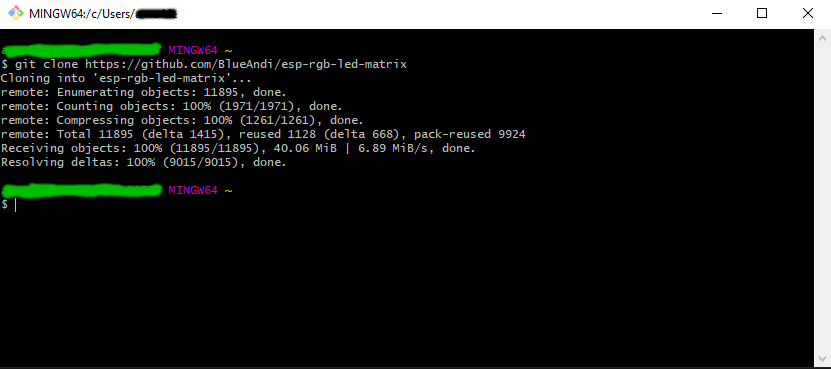
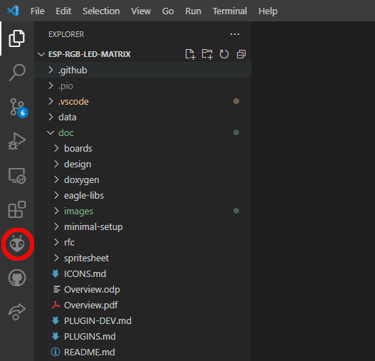
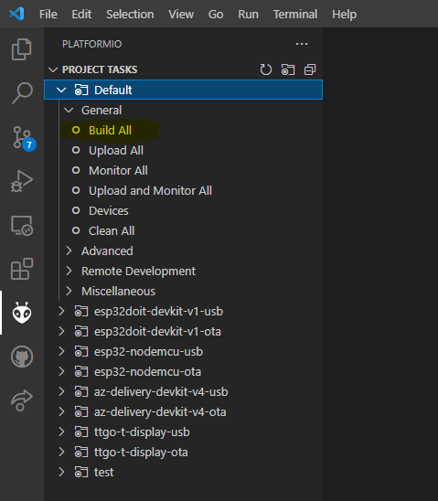
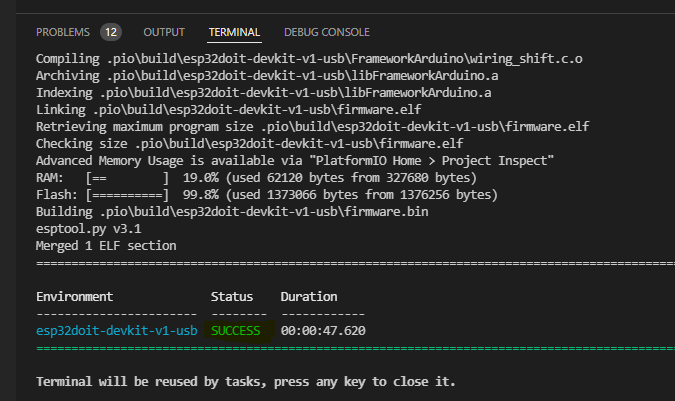

# PIXELIX <!-- omit in toc -->


[](http://choosealicense.com/licenses/mit/)

# Build The Software <!-- omit in toc -->

* [Retrieve The Project](#retrieve-the-project)
* [Build Project](#build-project)
* [Next Step](#next-step)
* [Issues, Ideas And Bugs](#issues-ideas-and-bugs)
* [License](#license)
* [Contribution](#contribution)

# Retrieve The Project

Open a console (windows: git bash) and get the project via
```
$ git clone https://github.com/BlueAndi/esp-rgb-led-matrix
```

Example:



:warning: If you download the project from github, because you skipped the git installation, the build may fail because it can happen that other necessary libraries can not be automatically cloned by PlatformIO.

# Build Project
Now its time to build the software for the appropriate target.

1. Load workspace in VSCode.
2. Change to PlatformIO toolbar (click on the head of the ant in the left column).



3. Lets now build the software independent of your specific board, just to see whether it works by _Project Tasks -> Default -> Build All_ or via hotkey ctrl-alt-b



4. If no error happened, you are ready.



Note, the default project is esp32 DevKit v1 board, programming via USB.

# Next Step
The toolchain is working and the firmware gets built. [Next step](SW-UPDATE.md) is now to build it specific for your target and upload it.

# Issues, Ideas And Bugs
If you have further ideas or you found some bugs, great! Create a [issue](https://github.com/BlueAndi/esp-rgb-led-matrix/issues) or if you are able and willing to fix it by yourself, clone the repository and create a pull request.

# License
The whole source code is published under the [MIT license](http://choosealicense.com/licenses/mit/).
Consider the different licenses of the used third party libraries too!

# Contribution
Unless you explicitly state otherwise, any contribution intentionally submitted for inclusion in the work by you, shall be licensed as above, without any
additional terms or conditions.
