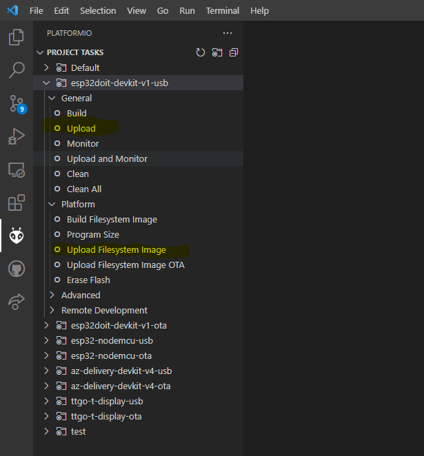

# PIXELIX <!-- omit in toc -->


[](http://choosealicense.com/licenses/mit/)

# Update The Software <!-- omit in toc -->

* [Purpose](#purpose)
* [Recommendations](#recommendations)
  * [Non-Developer](#non-developer)
  * [Developer](#developer)
* [Update possibilities](#update-possibilities)
  * [Use Espressif Flash Download Tool (Windows only)](#use-espressif-flash-download-tool-windows-only)
  * [Use esptool](#use-esptool)
    * [Debian Linux](#debian-linux)
    * [Windows](#windows)
    * [Common after python and esptool are installed](#common-after-python-and-esptool-are-installed)
  * [Use VSCode and Platformio](#use-vscode-and-platformio)
* [Update via USB](#update-via-usb)
* [Use the browser](#use-the-browser)
* [Flash Layout Information](#flash-layout-information)
* [Issues, Ideas And Bugs](#issues-ideas-and-bugs)
* [License](#license)
* [Contribution](#contribution)

# Purpose
The software can be uploaded/updated to the development board in 4 different ways. Not all of them can be used in any case. Take a look to the recommendations which variant might be the best for you.

# Recommendations
The recommeded way how to program the software to the board depends on the skill level, as well as the available toolchain. Hopefully it helps you to choose the right one.

## Non-Developer

| Use Case | Recommended To Use |
| -------- | ------------------ |
| Brand new development board, with only the preinstalled software on it. | **Windows:** Espressif Flash Download Tool<br>**Linux:** esptool |
| A development board already used by you. | **Windows:** Espressif Flash Download Tool<br>**Linux:** esptool |
| Pixelix is already running on the development board. Its webinterface is accessible. | Browser |

## Developer

| Use Case | Recommended To Use |
| -------- | ------------------ |
| Development board, not running Pixelix and you don't like to install VSCode and PlatformIO. | **Windows:** Espressif Flash Download Tool<br>**Linux:** esptool |
| Development board, not running Pixelix and you like to go the developers way. | VSCode and PlatformIO |
| You like to develop a plugin or change code for a pull request. | VSCode and PlatformIO |
| Pixelix is already running on the development board. | Browser |

# Update possibilities

## Use Espressif Flash Download Tool (Windows only)
1. Download binaries (```esp-rgb-led-matrix-v6.0.0.zip```) from the [latest release](https://github.com/BlueAndi/esp-rgb-led-matrix/releases).
2. Unzip to a local folder.
3. Download the [Espressif Flash Download Tool](https://www.espressif.com/en/support/download/other-tools).
4. Unzip to a local folder.
5. Connect your development board with the PC.
6. Start the Espressif Flash Download Tool with the executable ```flash_download_tool_<version>.exe```.
7. Choose _ChipType_, depended on the development board you have.
8. Choose _WorkMode_ "Develop".
9. Choose _LoadMode_ "UART".
10. Click on OK.
11. Select binaries in the order and with the addresses of the [flash layout table](#flash-layout-information).
12. Choose _SPI SPPED_: 40 MHz
13. Choose _SPI MODE_:
    * esp32: DIO
    * esp32-s3: QIO
14. Choose _COM_, e.g. COM4 which depends how the virtual COM port was mounted for the plugged in development board.
15. Start flashing by clicking on _START_ in the DownloadPanel 1.
16. The state will change from _IDLE_ to _SYNC_.
17. Keep _BOOT_ button on the development board pressed, until the state changes to _DOWNLOAD_.
18. Now wait until state changes to _FINISH_.
19. Its complete, close the tool.

## Use esptool

### Debian Linux
1. Update system packages: ```sudo apt-get update```
3. Install python toolchain: ```sudo apt-get install python3-pip```
4. Verify successful installation: ```pip3 --version```
5. Install esptool: ```sudo pip3 install esptool```

### Windows
1. Download and install latest [Python](https://www.python.org/) version.
2. During the installation ensure that Python will be set on the path.
3. Install esptool: ```pip install esptool```

### Common after python and esptool are installed
1. Verify successful esptool installation: ```esptool --version```
2. Erase flash: ```esptool -c <chip-type> -p <port> erase_flash```
    * Note: Replace &lt;chip-type&gt; with the chip type of your development board, e.g. esp32. Replace &lt;port&gt; with the serial port the development board is connected too, e.g. ```COM4``` on Windows or ```/dev/ttyUSB0``` on Linux.
3. After the "Connecting" message appears, keep _BOOT_ button on the development board pressed until procedure starts.
4. Write binaries to flash and choose the addresses from the [flash layout table](#flash-layout-information): ```esptool -p <port> write_flash --flash_mode <spi-mode> --flash_size <flash-size> <bootloader-address> bootloader.bin <partitions-address> partitions.bin <firmware-address> firmware.bin <littlefs-address> littlefs.bin```
    * Replace &lt;port&gt; with the serial port the development board is connected too, e.g. ```COM4``` on Windows or ```/dev/ttyUSB0``` on Linux.
    * Use _DIO_ for &lt;spi-mode&gt; in case of esp32, except esp32-s3 use _QIO_.

## Use VSCode and Platformio
If your board is not available out of the box, have a look for the [supported boards by platformio](https://docs.platformio.org/en/latest/platforms/espressif32.html#boards). Copy a board configuration block in the ```platformio.ini``` and overwrite the board configuration (```board = ...```) by using the right board id from [supported boards by platformio](https://docs.platformio.org/en/latest/platforms/espressif32.html#boards).

The update consists of two parts:
* The software.
* The filesystem.

# Update via USB
Steps:
1. Load workspace in VSCode.
2. Change to PlatformIO toolbar (click on the head of the ant in the left column).
3. Software:
   1. _Project Tasks -> env:```<choose-your-board>``` -> General -> Build_
   2. _Project Tasks -> env:```<choose-your-board>``` -> General -> Upload_
4. Filesystem:
   1. _Project Tasks -> env:```<choose-your-board>``` -> Platform -> Build Filesystem Image_
   2. _Project Tasks -> env:```<choose-your-board>``` -> Platform -> Upload Filesystem Image_

Example:



Note: Sometimes it happens that the _Platform_ sub-menu in the PlatformIO Project Tasks is missing. In this case restart VSCode and it should appear.

# Use the browser
Preconditions:
* PIXELIX runs already on the target.

Steps:
1. Build the software via _Project Tasks -> General -> Build All_
2. Build the filesystem via _Project Tasks -> env:```<choose-your-board>``` -> Platform -> Build File System Image_.
3. Now in the ```.pio/build/<choose-your-board>``` folder there are two important files:
   1. The software for the device: ```firmware.bin```
   2. The prebuilt filesystem for the device: ```littlefs.bin``` (or ```spiffs.bin``` for Pixelix &lt; 6.x.x)
4. Open browser add enter ip address of the device.
5. Jump to Update site.
6. Select firmware binary (```firmware.bin```) or filesystem binary (```spiffs.bin```/```littlefs.bin```) and click on upload button. Since Pixelix v6.x its possible to update the firmware and filesystem at once. Multi-select both binaries in this case.

# Flash Layout Information

| Binary | Address (hex) |
| ------ | ------------- |
| bootloader.bin | 0x1000 |
| partitions.bin | 0x8000 |
| firmware.bin | 0x10000 |
| littlefs.bin | see next table |

| Development Board | Flash size in MByte | Address (hex) of littlefs.bin |
| ----------------- | ------------------------ | ----------------------------- |
| esp32doit-devkit-v1 | 4 | 0x2b0000 |
| esp32-nodemcu | 4 | 0x2b0000 |
| az-delivery-devkit-v4 | 4 | 0x2b0000 |
| lilygo-ttgo-t-display | 8 | 0x670000 |
| lilygo-t-display-s3 | 16 | 0xc90000 |
| adafruit_feathrer_esp32_v2 | 8 | 0x670000 |

# Issues, Ideas And Bugs
If you have further ideas or you found some bugs, great! Create a [issue](https://github.com/BlueAndi/esp-rgb-led-matrix/issues) or if you are able and willing to fix it by yourself, clone the repository and create a pull request.

# License
The whole source code is published under the [MIT license](http://choosealicense.com/licenses/mit/).
Consider the different licenses of the used third party libraries too!

# Contribution
Unless you explicitly state otherwise, any contribution intentionally submitted for inclusion in the work by you, shall be licensed as above, without any
additional terms or conditions.
